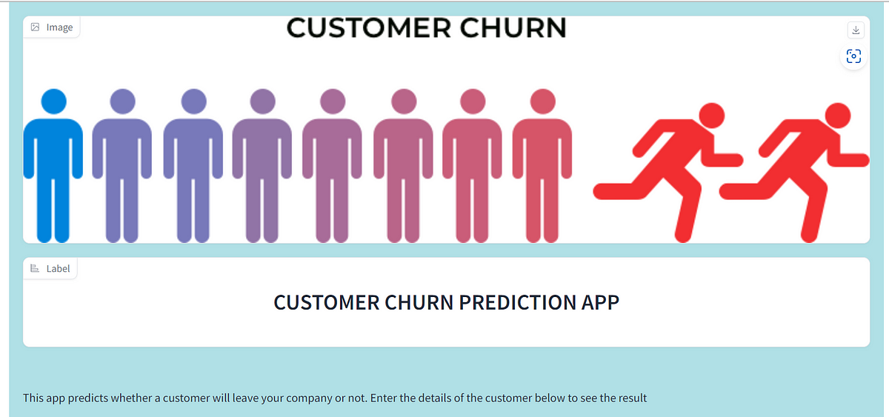
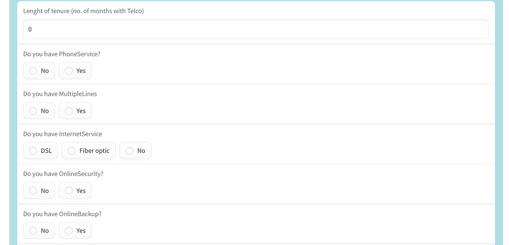
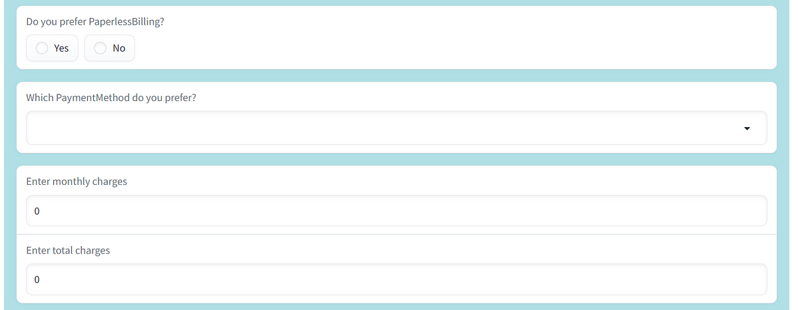
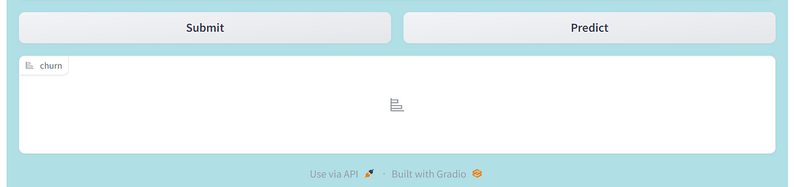

# churn-prediction-with-gradio
This repository contains code and resources for building a churn prediction model using machine learning techniques, and deploying it with Gradio for a user-friendly interface. Gradio is used to create a web interface for the trained model, which allows users to input customer data and get predictions on their likelihood of churning. 

## Summary
| Code      | Name        | Published Article |  Deployed App |
|-----------|-------------|:-------------:|------:|
| LP4 | Magical Machine Learning |  [https://medium.com/@alidu143/building-a-customer-churn-prediction-web-app-with-gradio-a-step-by-step-guide-5d7d77ede323](/) | [Best app of the world](/) |

## Project Description
Churn prediction is a critical task for businesses that want to retain their customers and optimize revenue. This repository contains code and resources for building a churn prediction model using machine learning techniques, and deploying it with Gradio for a user-friendly interface.

The code includes data preprocessing, feature engineering, model training, and evaluation using Python and popular machine learning libraries such as Scikit-learn and XGBoost. The trained model is then deployed using Gradio, which allows users to input customer data and get predictions on their likelihood of churning. The Gradio interface is intuitive and easy to use, even for non-technical users.

The repository includes a demo notebook that showcases how to use the trained model in the Gradio interface, as well as instructions for reproducing the project. This project can be useful for anyone interested in learning how to build a churn prediction model and deploy it with Gradio.

## Setup

## Installation
Download or Clone the repository and navigate to the project directory. Clone this repository to your local machine using the following command:

git clone https://github.com/aliduabubakari/churn-prediction-with-gradio 

## Install the dependencies

Navigate to the cloned repository and run the command:

pip install -r requirements.txt

## App Execution

## Author
Alidu Abubakari